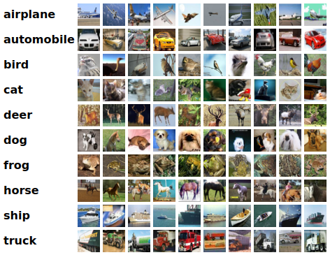

# Part 1: MLPs, CNNs and Backpropagation

The first part of this project focuses on implementing a Neural Network from scratch, to get a good understanding of the underlying mathematical operations and the workings of the backpropagation algorithm.

Next, using PyTorch we focus on image classification on the CIFAR-10 dataset using Multi-layer Perceptrons (MLP) and Convolutional Neural Networks (CNNs).

## MLP backprop and NumPy implementation

Analytic gradients are derived in the report, after which we implement a MLP from scratch using `numpy`. We train this MLP on the [CIFAR-10 dataset](https://www.cs.toronto.edu/~kriz/cifar.html). Code can be found in  `mlp_numpy.py`.

  

    CIFAR dataset. <a href="https://www.cs.toronto.edu/~kriz/cifar.html">Source</a>.

## PyTorch MLP

Next, we implement a MLP using PyTorch in `mlp_pytorch.py`.

## PyTorch CNN

Finally, we implement a small Convolutional Neural Network (CNN) based on the popular VGG network in `convnet_pytorch.py`.
