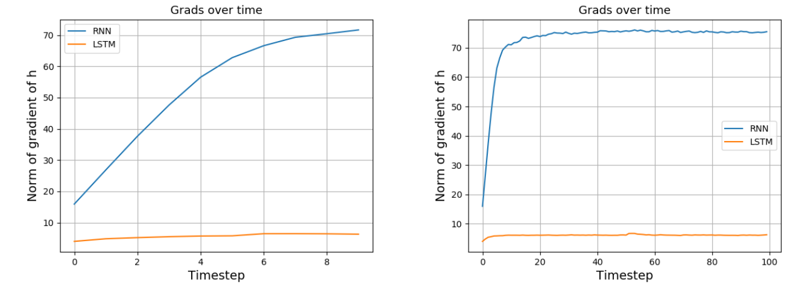

## Part 2: Recurrent Neural Networks and Graph Neural Networks

In the second part of this project we try to gain a better understanding of Recurrent Neural Networks (RNNs) and Long Short-Term Networks (LSTM) by diving into the theory and training the models on text data. Finally, we also generate text with various sampling techniques.

## Vanilla RNN versus LSTM

For the first task, `part 1`, we will compare vanilla Recurrent Neural Networks (RNN) with Long-Short Term Networks (LSTM). Implementations can be found in `vanilla_rnn.py` and `lstm.py`. Results are analyzed in the report.

  

    Gradient magnitude over time steps for input length of 10 (left) and input length of 100 (right) for vanilla RNN and LSTM. 

## Recurrent Nets as Generative Model

In `part 2` we build a LSTM for generation of text. By training an LSTM to predict the next character in a sentence, the network will learn local structure in text.

## Graph Neural Networks

Finally, we analyse Graph Neural Netwoks in the report. Graph convolutional neural networks are widely known architectures used to work with graph-structured data.

  

    Example of a graph network.

