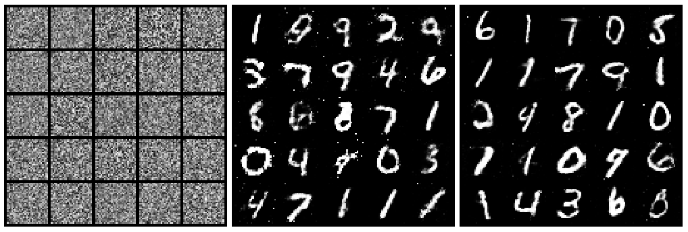

## Part 3: Deep Generative Models: VAEs, GANs and Normalizing Flows (NFs)

The last part of this project studies and implements three popular and powerful generative models: Variational Auto Encoders (VAEs), Generative Adversarial Networks (GANs) and Generative Normalizing Flows (NFs).

## Variational Auto Encoder (VAE)

In this part, we analyse latent variable models and the Variational Auto Encoder (VAE).

  

    Plot of the manifold of a 2-dimensional latent space of the VAE after training.

## Generative Adversarial Networks (GAN)

In this part, we build a GAN using PyTorch. 

  

    Schematic overview of a GAN. <a href="https://www.freecodecamp.org/news/an-intuitive-introduction-to-generative-adversarial-networks-gans-7a2264a81394">Source</a>.

We sample from this GAN and analyse results. We also interpolate between these two digits in latent space.

  

    Plot of the sampled images from the GAN before training, halfway through training and at the end of training.

## Generative Normalizing Flows (NFs)

  

    Illustration of a normalizing flow model, transforming a simple distribution $p_0(z_0)$ to a complex one $p_K(z_K)$. <a href="https://lilianweng.github.io/posts/2018-10-13-flow-models/">Source</a>

