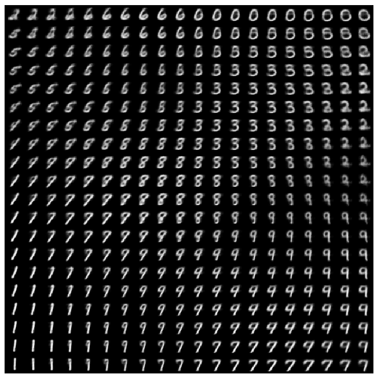

# Deep Learning Methods

This repository contains code for Deep Learning projects in PyTorch: From implementing simple Neural Networks from scratch in `numpy`, to studying Convolutional Neural Networks (CNNs), Recurrent Neural Networks (RNNs) and Variational Auto-encoders (VAE).

## Part 1: MLPs, CNNs and Backpropagation

The first part of this project focuses on implementing a Neural Network from scratch, to get a good understanding of the underlying mathematical operations and the workings of the backpropagation algorithm.

Next, using PyTorch we focus on image classification on the CIFAR-10 dataset using Multi-layer Perceptrons (MLP) and Convolutional Neural Networks (CNNs).

  

    CIFAR dataset. <a href="https://www.cs.toronto.edu/~kriz/cifar.html">Source</a>.

## Part 2: Recurrent Neural Networks and Graph Neural Networks

In the second part of this project we try to gain a better understanding of Recurrent Neural Networks (RNNs) and Long Short-Term Networks (LSTM) by diving into the theory and training the models on text data. Finally, we also generate text with various sampling techniques.

  

    Gradient magnitude over time steps for input length of 10 (left) and input length of 100 (right) for vanilla RNN and LSTM.

## Part 3: Deep Generative Models: VAEs, GANs and Normalizing Flows (NFs)

The last part of this project studies and implements three popular and powerful generative models: Variational Auto Encoders (VAEs), Generative Adversarial Networks (GANs) and Generative Normalizing Flows (NFs).

  

    Plot of the manifold of a 2-dimensional latent space of the VAE after training.

  

    Plot of the sampled images from the GAN before training, halfway through training and at the end of training.

  

    Illustration of a normalizing flow model, transforming a simple distribution $p_0(z_0)$ to a complex one $p_K(z_K)$. <a href="https://lilianweng.github.io/posts/2018-10-13-flow-models/">Source</a>

--- 

### Acknowledgements

These projects are from the Deep Learning Course, held at the University of Amsterdam in the Fall of 2019.
